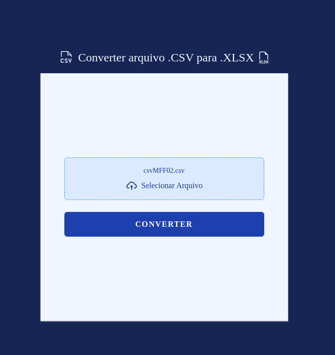

# CONVERT FILE CSV


> Esta é uma aplicação simples para converter um arquivo .csv em um arquivo .xlsx

<div style="width:100%; display:flex; align-items:center; gap:16px">
    
</div>

## Detalhes do aplicativo

- A ideia surgiu quando precisei converter um arquivo, existem diversos sites que fazem essa conversão, 
então achei interessante o desafio.

## 🚀 Melhorias futuras
- [x] - Conversão em lote
- [x] - Converter outras extensões

## 💻 Como usar o projeto
Para utilizar e testar o projeto, esteja em um computador com Node Js instalado e siga as
etapas abaixo:

1 clone o projeto com o comando
```
git clone https://github.com/IgorAlvesR/convert-csv
```
2 Acesse o projeto pelo terminal com o comando
```
cd converter
```
3 Instale o gestor de pacotes pnpm com o comando
```
npm install -g pnpm
```
4 Instale as dependências necessárias com o comando
```
pnpm install
```
5 Rode o projeto com o comando
```
pnpm run dev
```

## 🌐 Links úteis
[NodeJS](https://nodejs.org/en/download)
[NextJS](https://nextjs.org/)
[Tailwind](https://tailwindcss.com/)


## 🧑‍💻 Igor Alves Rodrigues

[](https://www.linkedin.com/in/igor-alves-rodrigues-7941a116b/)
[](https://gthub.com/igoralvesr)
[](http://wa.me/5548998434969)
[](https://igoralvesr.github.io)